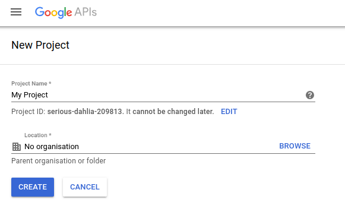
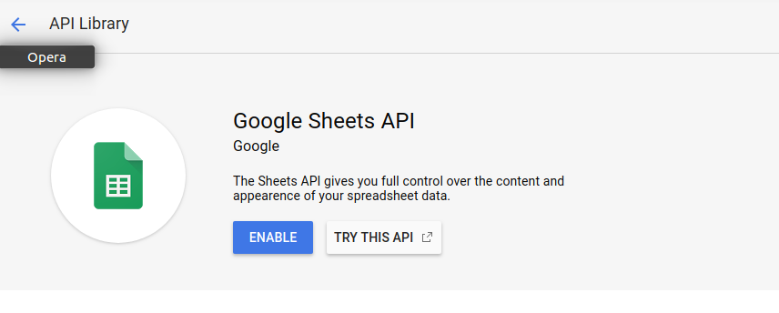
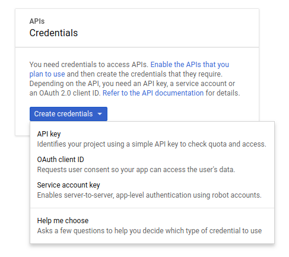
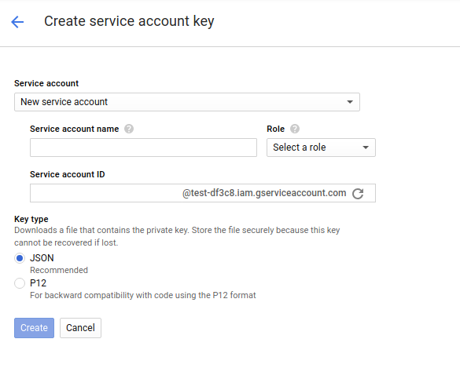
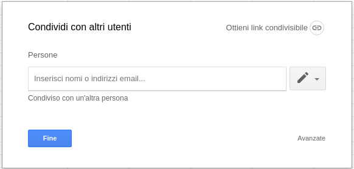

# Google Spreadsheets updates in Python

Stats CI helps you to track any measurable information you want to analyse of your project. To give this kind of flexibility, Stats CI allows you to pass a JSON value in input, that will be appended as a row into a Google Spreadsheet you define. In this way you can keep track of the informations of your specific build. The final goal is to compare data, create statistics and graphs on the project going on.

Some examples of data you can track with this project are: 
- The size of the library you are building;
- The number of files of the project;
- The percentage of modification between the current and the past commit;
- Any numeric value you'd like to keep under control :)

The input of the program must be a JSON with the structure `"column_name":"value"`; `column_name` must be present in the first line (the header) of the Google Spreadsheet file. If it isn't the entire operation will abort.

The program is designed to work with [Travis CI](https://travis-ci.org/). For this reason it use a .yml settings file to set information related to the Spreadsheet to update.

The file can be private, that means that it is necessary to activate Google Spreadsheet API and use credential to connect to the file. Credential are stored in a JSON.

## Requirements
- Python 3.x
- [gspread](https://github.com/burnash/gspread):
```bash
$ pip install gspread
```
- Oauth2client:
```bash
$ pip install oauth2client
```

## Installation
Before using the script in it necessary to obtain the OAuth2 credentials from the Google Developer Console (as detailed in the [gspread documentation](http://gspread.readthedocs.io/en/latest/oauth2.html)):

1. Create a new project in the [Google Developers Console](https://console.developers.google.com).

2. In "APIs & Services">"Library" select "Google Sheets API" and enable the API.

3. In "Credential" select "Create credential">"Service Account Key" and download the JSON file.


4. Create the new private Google Spreadsheet and from the file sharing option share it with the email `client_email` that is present in the credential JSON file, otherwise you won't be able to read or modifity the file (you will receive a 403 error).

5. In order to use the program, you need the spreadsheet key and the worksheet index. Indexes start from 0, i.e. sheet 1 is at index 0. The spreadsheet key can be retrieved from the URL:
```
https://docs.google.com/spreadsheets/d/<spreadsheet_key>/edit
```

## Example

```bash
$ cat input.json | python update_stats.py --creds <cred file>
```

`creds.json` contains the credentials (see "Installation" for details).

The input file must be a json with the following structure:
```json
{"Fruit": "Apple", "Colour": "Red","Weight": "150"}
```

In this case, the Google Spreadsheet contains the following data:

| Fruit         | Colour        | Weight |
| ------------- |---------------| ------:|
| Orange        | Orange        | 130    |
| Banana        | Yellow        | 165    |
| Pear          | Green         | 180    |

After running the program the table will be updatedi. The new line will be added at the top of the document, after the header row:

| Fruit         | Colour        | Weight |
| ------------- |---------------| ------:|
| Apple         | Red           | 150    |
| Orange        | Orange        | 130    |
| Banana        | Yellow        | 165    |
| Pear          | Green         | 180    |

The Google Spreadsheet to update is defined in the settings.yml file. This file has the following structure:
```yaml
workspaces:
    default:
        -alias: progStats
        -spreadsheet_key: key0
        -worksheet_index: 0
    workspace1:
        -alias: generalStats
        -spreadsheet_key: key1
        -worksheet_index: 4
```
A workspace is the combination of a spreadsheet and a worksheet of that file.
If the program has no argument the `default` workspace is used, otherwise it is possible to use the workspace alias to refer to a specific workspace or directly input a spreadsheet key and the worksheet index at runtime:

```bash
$ cat input.json | python update_stats.py --creds <cred_file> --workspace <alias>
```
```bash
$ cat input.json | python update_stats.py --creds <cred_file> --sk <key> --wi <index>
```

Use `-h` to see the program help.

## Author
Silvia Vitali, [sia4](https://github.com/sia4).

## License
[nome] is available under the MIT license. See the LICENSE file for more info.
